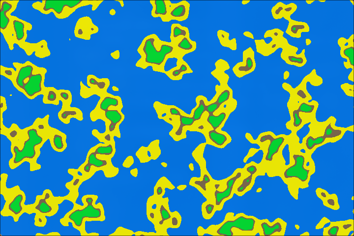

# procedure top down world generation

Procedural world generator. Made with C++, using [FastNoiseLite.h](https://github.com/Auburn/FastNoiseLite) for noise generation and [raylib](https://www.raylib.com/) for rendering.

